# 大数据系统基础

## 实验二： Hadoop并行编程

### 邹永浩 2019211168

### 任务1. Hadoop DFS 常用指令

1. ls 查看文件夹信息
    
    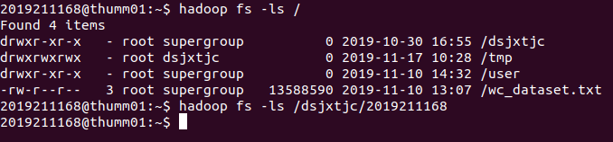

2. copyFromLocal 上传文件

    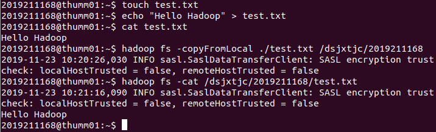

3. copyToLocal 下载文件

    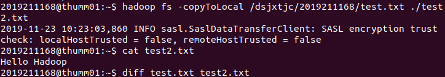

    可以观察到下载后与原文件相同

4. 更改 Hadoop 日志级别

    前面测试时客户端总是打出一条 SASL 的 INFO 日志，去掉的话可以把日志级别调高，毕竟我们的原则是 ERROR 以下的不看 :)
    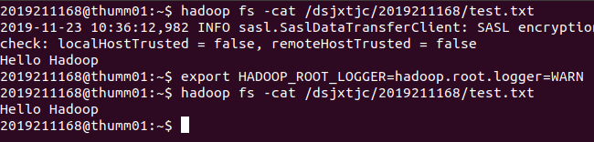


### 任务2. 使用 MapReduce 进行词频统计

1. 测试文件

    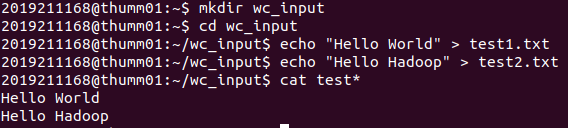

2. 上传文件

    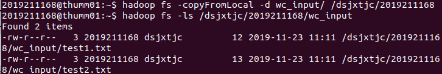

3. 用 C++ 写一个 MapReduce

    ```c++
        #include "Pipes.hh"
        #include "TemplateFactory.hh"
        #include "StringUtils.hh"

        using namespace std;

        class WordCountMapper : public HadoopPipes::Mapper {
        public:
            // constructor: does nothing
            WordCountMapper( HadoopPipes::TaskContext& context ) {}

            // map function: receives a line, outputs (word,"1")
            // to reducer.
            void map( HadoopPipes::MapContext& context ) {
                //--- get line of text ---
                string line = context.getInputValue();

                //--- split it into words ---
                vector< string > words =
                HadoopUtils::splitString( line, " " );

                //--- emit each word tuple (word, "1" ) ---
                for ( unsigned int i=0; i < words.size(); i++ ) {
                    context.emit( words[i], HadoopUtils::toString( 1 ) );
                }
            }   
        };

        class WordCountReducer : public HadoopPipes::Reducer {
        public:
            // constructor: does nothing
            WordCountReducer(HadoopPipes::TaskContext& context) {}

            // reduce function
            void reduce( HadoopPipes::ReduceContext& context ) {
                int count = 0;

                //--- get all tuples with the same key, 
                //and count their numbers ---
                while ( context.nextValue() ) {
                count += HadoopUtils::toInt( context.getInputValue() );
                }

                //--- emit (word, count) ---
                context.emit(context.getInputKey(),
                    HadoopUtils::toString( count ));
            }
        };

        int main(int argc, char *argv[]) {
            return HadoopPipes::runTask(HadoopPipes::TemplateFactory<
                                    WordCountMapper,
                                    WordCountReducer >() );
        }

    ```

    针对实验环境，Makefile 如下：
    
    ```make
    C=g++
    HADOOP_INSTALL=/opt/server/hadoop/3.2.1
    PLATFORM=Linux-amd64-64
    CPPFLAGS=-m64 -I$(HADOOP_INSTALL)/include

    wordcount: word_count.cpp
            $(CC) $(CPPFLAGS) $< -Wall \
              -L$(HADOOP_INSTALL)/lib/native \
              -L/lib/x86_64-linux-gnu/ -lhadooppipes \
              -lhadooputils -lpthread \
              /lib/x86_64-linux-gnu/libcrypto.so.1.0.0 \
              -g -O2 -o $@
    ```

    直接使用 make 进行编译，然后上传

    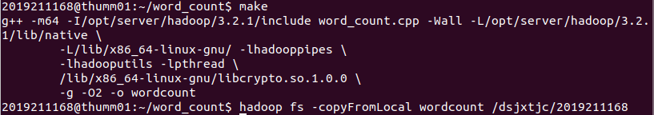

4. 使用 pipes 命令运行

    ```
    hadoop pipes -Dhadoop.pipes.java.recordreader=true \
    -Dhadoop.pipes.java.recordwriter=true \
    -input /dsjxtjc/2019211168/wc_input \
    -output /dsjxtjc/2019211168/wc_output \
    -program /dsjxtjc/2019211168/wordcount
    ```
    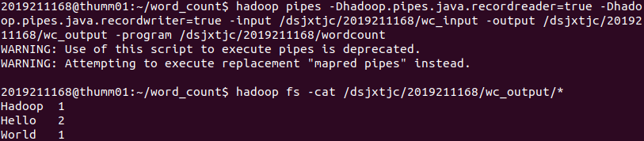

5. 复制到本地

    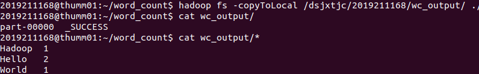

### 任务3. 设计自己的分布式文件系统

#### 1. YADK (Yet Another DFS in Kotlin)

使用 Kotlin 实现了一个简单的DFS系统，Kotlin号称 Better Java，而且支持编译到Native(当然这次作业仍然是JVM平台)，正好趁这次机会学习一下。

本系统使用著名的网络工具 Netty，实现了 nio、 zero-copy 技术，传输大文件更快。
实现了一个简单的 MapReduce 框架，用户使用DSL编写程序，并可以通过客户端上传文件、下载文件、提交代码、获取执行结果等。

源代码 https://github.com/zouyonghao/YADK

#### 2. 系统设计

##### 2.1 分布式文件系统

本系统使用 Master - Slave 架构，Master 维护文件信息(即 NameNode)、用户程序、用户 Job 的状态等，Slave 负责存储文件(即 DataNode)

Master 存储文件信息方式为在本地指定文件夹下，创建一个该文件的目录，目录下有一个 `item.json` 文件，保存了文件的相关信息。例如用户上传了一个 `abc/number` 的文件， Master 的根目录为 `name_sdfs`:

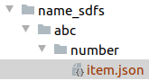

`item.json` 中记录了文件的长度、`Partition`大小、 `partition` 和 `replica` 信息， `partitions` 数组的每一项代表了一个 `partition`，每个 `partition` 仍是一个 `List<String>` ，记录了 `replica` 信息。(这个 `json` 格式是阿里的 `fastjson` 特有的)

```json
{
    "fileLength": 4889465,
    "partitionSize": 3,
    "partitions": [
    [
        {
            "folder": "data_sdfs2",
            "ip": "localhost",
            "port": 6734
        },
        {
            "folder": "data_sdfs1",
            "ip": "localhost",
            "port": 6733
        }
    ],
    [
        {
            "$ref": "$.partitions[0][0]"
        },
        {
            "$ref": "$.partitions[0][1]"
        }
    ]
    ],
        "success": true
    }
```

Slave 则直接存储文件的 Partition，路径与用户指定路径相同，只不过增加了7位数字后缀表示序号

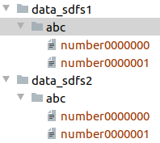

图中表示用两个 Slave 存储 文件的两个 Partition，由于指定的 replica 是 2，所以每个 Slave 中都有两个 Partition

用户上传文件的流程如下：

```
1. 本地按照 Partition 大小将文件分割

2. 给 Master 发消息，表示需要上传文件，附带文件大小信息

3. Master 生成文件信息，并给每个 Partition 和 Replica 分配 Slave，分配时策略为同一个 Partition 的不同 Replica 尽量分配到不同机器上

4. 收到分组信息和分配信息后，客户端连接 Slave 上传文件
```

用户下载文件过程类似：
```
1. 向 Master 发送下载请求，获取文件 Partition 信息

2. 根据分区信息，随机选择 Slave 下载 Partition

3. 本地将文件合并
```

##### 2.2 MapReduce

1. DSL

    JVM 支持使用运行其他语言的脚本，比如 JS，而 Kotlin 官方也接入了这个体系，支持运行一些简单的脚本，因此可以实现用户自己编写程序然后上传。(不过目前运行的效率很低)

    用户可以使用规定的DSL(API)，使用Kotlin编写 MapReduce 程序，目前支持四种 API，例如以下程序为计算文件中所有数字的和

    ```kotlin
    // 读取文件
    sdfsRead("abc/number")
    // Map (每次使用上一条指令的结果)
    sdfsMap({ a: String -> a.split("\n") })
    // Map (每次使用上一条指令的结果)
    sdfsMap({ a: List<String> -> a.filter{ it.isNotEmpty() }.map{ it.toInt() } })
    // Shuffle，用户规定中间结果如何分片
    sdfsShuffle { a:Int -> a / 10000 }
    // Reduce 将分片的中间结果进行处理
    sdfsReduce({ a: List<Int> -> a.reduce { i, j -> i + j } })
    ```

    目前，用户程序可以有多个 Map 函数，但只能有一个 Shuffle 和 一个 Reduce

2. JobTracker

    Master 上运行一个 JobTracker 线程，用来管理Job的运行情况。用户提交代码时，生成一个UUID，此时会将用户程序进行存储，并发送给所有Slave，程序保存在目录的`__program__`。

    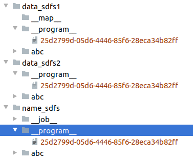
    
    之后 JobTracker 启动一个同一ID的Job开始运行，分析并执行用户代码。
    
    如果当前指令为`sdfsRead`方法，则获取用户要读取的文件名，并保存到 Job 的上下文中。
    
    如果当前指令为`sdfsMap`，则根据文件的分片，将 Map 任务分配到有当前文件分片且运行正常的 Slave 上，同时发送当前执行到第几行。Slave收到后读取分片文件，在该文件上依次执行用户的函数直到遇到`sdfsShuffle`，根据`Shuffle`的结果写入不同的中间文件。
    在上面的示例中，由于我之前生成的数字文件都在10000以下，所以`Shuffle`之后中间文件为一个文件。执行完成后，将中间文件保存到本机的 `__map__`目录下，并把相关路径传给 Master。

    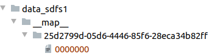

    如果当前指令为`sdfsReduce`，则在有中间文件的机器上随机分配一个 Slave 执行 Reduce 任务。Slave 根据中间文件信息，先把中间文件下载到 `__reduce__`目录下，然后依次对文件读入，转为用户函数的参数类型进行转换，执行用户函数。最后的结果放入对应文件的 `.result` 文件中。

    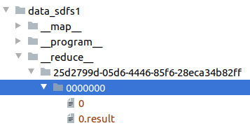

##### 2.3 客户端

因为项目构建后为 jar 文件，执行比较麻烦，因此写一个脚本执行
```bash
java -cp ./target/SimpleDFS-1.0-SNAPSHOT-jar-with-dependencies.jar \
cn.edu.tsinghua.sdfs.client.Client $1 $2 $3
```

客户端目前支持7种指令

`ls`: 显示某目录下的文件

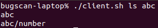

`copyFromLocal`: 上传文件

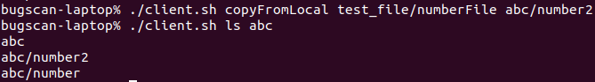

`copyFromRemote`: 下载文件

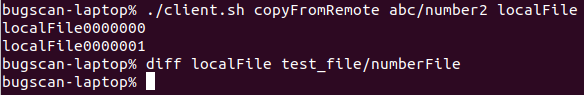

客户端直接下载所有 Partition 然后在本地进行合并，使用 diff 可以看到与之前上传的文件没有区别

`submit`: 提交程序

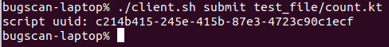

提交后，会看到一个 uuid，使用这个uuid可以查询程序执行结果

`jobStatus`: 查询程序执行信息，可以看到程序的中间结果、是否执行完毕等。

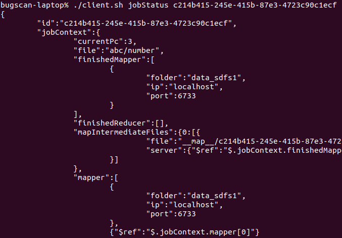

详细信息：
```json
{
	"id":"c214b415-245e-415b-87e3-4723c90c1ecf",
	"jobContext":{
		"currentPc":3,
		"file":"abc/number",
		"finishedMapper":[
			{
				"folder":"data_sdfs1",
				"ip":"localhost",
				"port":6733
			}
		],
		"finishedReducer":[],
		"mapIntermediateFiles":{0:[{
				"file":"__map__/c214b415-245e-415b-87e3-4723c90c1ecf/0000000",
				"server":{"$ref":"$.jobContext.finishedMapper[0]"}
			}]
		},
		"mapper":[
			{
				"folder":"data_sdfs1",
				"ip":"localhost",
				"port":6733
			},
			{"$ref":"$.jobContext.mapper[0]"}
		],
		"reduceResultFiles":{},
		"reducer":[
			{"$ref":"$.jobContext.mapper[0]"}
		]
	},
	"status":"SUSPEND",
	"userProgram":{
		"command":14,
		"content":"sdfsRead(\"abc/number\")\nsdfsMap({ a: String -> a.split(\"\\n\") })\nsdfsMap({ a: List<String> -> a.filter{ it.isNotEmpty() }.map{ it.toInt() } })\nsdfsShuffle { a:Int -> a / 10000 }\nsdfsReduce({ a: List<Int> -> a.count() })",
		"id":"c214b415-245e-415b-87e3-4723c90c1ecf"
	}
}
```

可以用`currentPc`看到当前执行到第三行

中间结果的路径`mapIntermediateFiles`等。

如果执行完了`status`就是`FINISHED`

`jobResult`： 获取程序执行结果

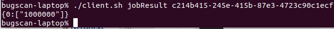

这里会分别显示每个分片的执行结果，这个上传的程序是计算有几行，之前测试生成了1000000行数字文件。

`sumJobResult`： 把获取到的结果加起来，只是为了方便

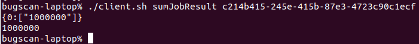

##### 2.4 错误容忍

如果用户指定了 Replica，则只要 Slave 数量大于 Replica ，系统仍然可以正常运行，上传、下载、提交任务均可，而且 Master 会每隔5秒尝试重连，重连后该 Slave 可以继续使用。

由于时间关系，暂未实现在 Job 运行过程中杀掉 Slave 的任务恢复。

#### 3. 计算均值和方差

##### 3.1 生成文件

本地生成了一个10000以内的随机数字文件，直接上传到服务器了。

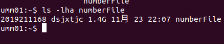

##### 3.2 部署系统

因为本机使用 JDK11 编译的，所以先在服务器上下载了JDK11

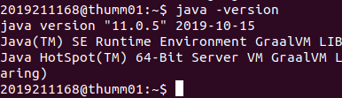

先上传程序到thumm01，然后传到其他机器

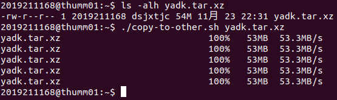

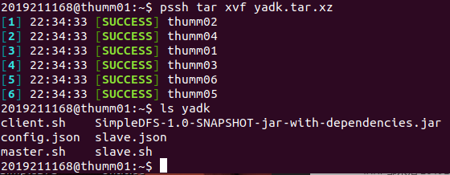

(PS. 之前名字叫 SimpleDFS...)

启动Slave

Salve的配置文件为

```json
{
  "ip": "0.0.0.0",
  "port": 6733,
  "folder": "data_yadk"
}
```

用 `0.0.0.0` 是因为可以在所有机器上统一，不过这样有一定安全隐患，不过我们这个测试影响不大。

在 thumm02 ~ thumm06 上启动

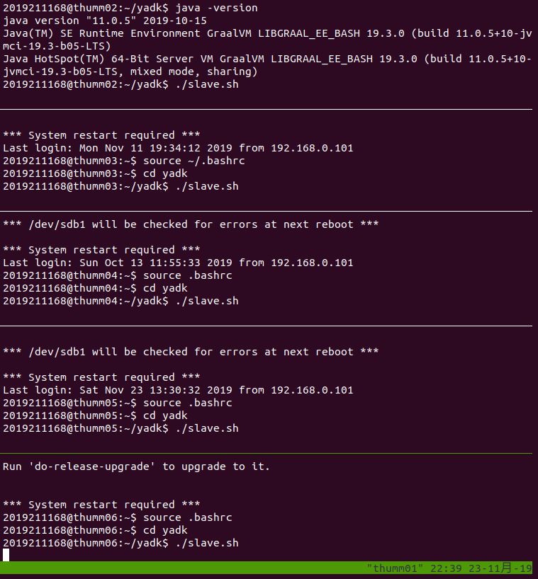

Master 的配置为

```json
{
  "master": {
    "ip": "thumm01",
    "port": 6732,
    "folder": "name_yadk"
  },
  "slaves": [
    {
      "ip": "thumm02",
      "port": 6733,
      "folder": "data_yadk"
    },
    {
      "ip": "thumm03",
      "port": 6733,
      "folder": "data_yadk"
    },{
      "ip": "thumm04",
      "port": 6733,
      "folder": "data_yadk"
    },{
      "ip": "thumm05",
      "port": 6733,
      "folder": "data_yadk"
    },{
      "ip": "thumm06",
      "port": 6733,
      "folder": "data_yadk"
    },
  ],
  "replication": 2,
  "blockSize": 128
}
```

在 thumm01 上启动

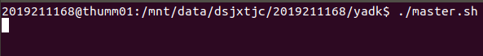


##### 3.3 上传测试文件

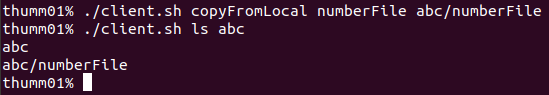

在 Slave 上会显示文件上传信息

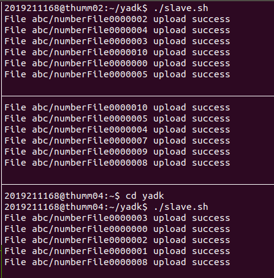

##### 3.4 下载文件

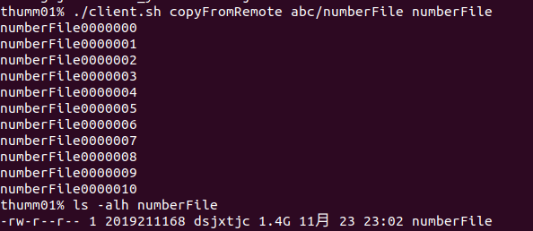

Slave 会显示相关信息

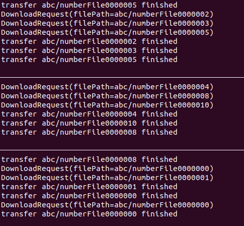

##### 3.5 计算总和、总个数、平方和

用户需要写三个程序

分别运行三个程序并获取结果：

计算总和：

```kotlin
sdfsRead("abc/numberFile")
sdfsMap({ a: String -> a.split("\n") })
// 整数可能溢出，所以使用 Double
sdfsMap({ a: List<String> -> a.filter{ it.isNotEmpty() }.map{ it.toDouble() } })
sdfsShuffle { a:Double -> a / 1000 }
sdfsReduce({ a: List<Double> -> a.reduce { i, j -> i + j } })
```

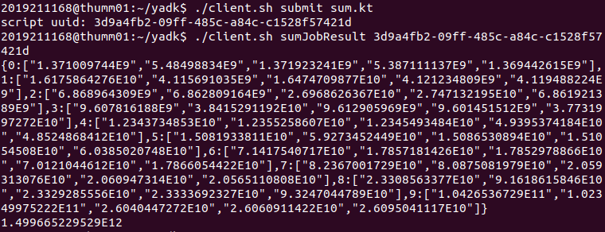

统计个数：

```kotlin
sdfsRead("abc/numberFile")
sdfsMap({ a: String -> a.split("\n") })
sdfsMap({ a: List<String> -> a.filter{ it.isNotEmpty() }.map{ it.toInt() } })
sdfsShuffle { a:Int -> a / 1000 }
sdfsReduce({ a: List<Int> -> a.count() })
```

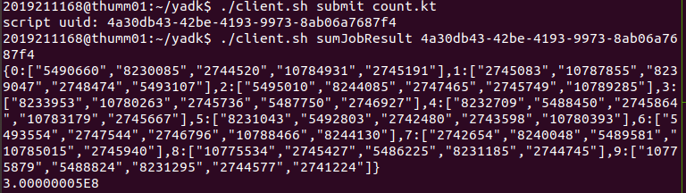

计算平方和：

```kotlin
sdfsRead("abc/numberFile")
sdfsMap({ a: String -> a.split("\n") })
// 整数可能溢出，所以使用 Double
sdfsMap({ a: List<String> -> a.filter{ it.isNotEmpty() }.map{ it.toDouble() * it.toDouble() } })
sdfsShuffle { a:Double -> a / (10000*1000) }
sdfsReduce({ a: List<Double> -> a.reduce { i, j -> i + j } })
```

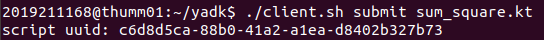

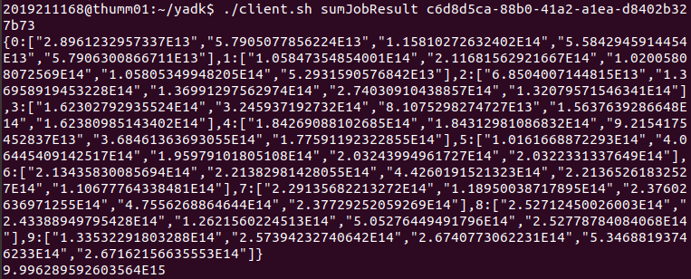

根据结果，计算均值和方差

这一步为了简单就直接在本地算了：

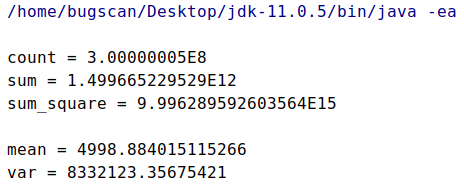

#### 4. 错误容忍

测试把 thumm06 的 Slave停掉，此时由于 Master 会一直尝试重连，所以会一直报错，但不影响功能：

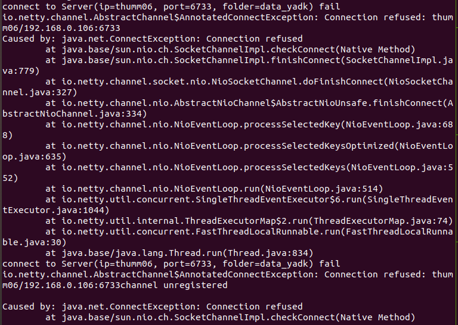

因为之前设置 Replica 为2，因此客户端可以上传下载文件：

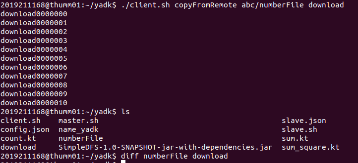

提交任务：

为了方便只测试一个1000行的文件：

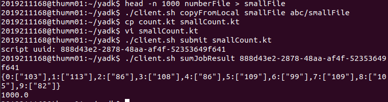

可以看到在 Slave 挂掉的时候提交和执行 Job 都正常

#### 5. 总结

本来想写个简单的系统，但觉得还是希望能支持用户自己写程序，没想到把自己坑了，花了好多时间。。

现在系统的整个流程还是稳定的，不过问题就是效率较低，主要是 Map 阶段需要一行一行执行，同时写入文件，脚本执行引擎以及文件IO都是瓶颈，还需要进一步优化。

下一步希望能把这个系统更加完善。